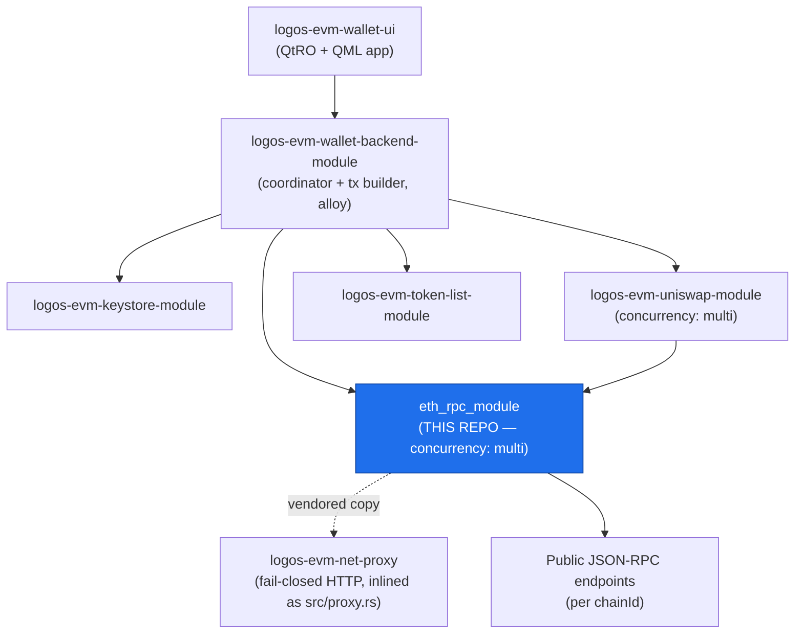
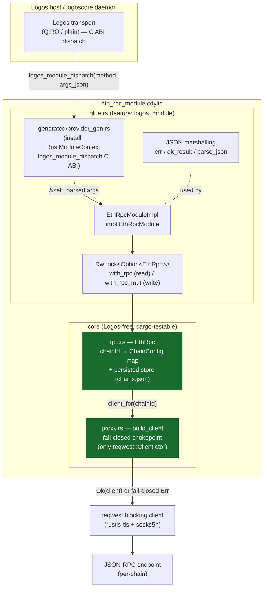

# `eth_rpc_module` — Specification & Reference

> Proxyable, fail-closed Ethereum JSON-RPC client for the Logos multi-chain EVM wallet.
> Per-chain config (endpoint + proxy policy); RPC calls keyed by `chainId`; `socks5h`/Tor-ready.

This document is the exhaustive reference for **`logos-evm-eth-rpc-module`**
(`github.com/logos-co/logos-evm-eth-rpc-module`). It is grounded entirely in the
repository source: `metadata.json`, `rust-lib/src/{lib.rs,glue.rs,rpc.rs,proxy.rs}`,
`rust-lib/Cargo.toml`, `flake.nix`, `CMakeLists.txt`, and the executable doc-test under
`doctests/`.

---

## 1. Purpose & place in the system

The "EVM wallet" is a multi-chain Ethereum wallet built as a set of **Logos modules** —
process-isolated plugins that talk over a Logos transport (QtRO / plain) via a typed RPC
bridge. A module exposes methods (here, a Rust trait) that other modules or the
`logoscore` daemon invoke through a generated client.

`eth_rpc_module` is the wallet's **multi-chain JSON-RPC transport**. It is a thin,
privacy-hardened gateway between the rest of the wallet and the public Ethereum-family
RPC endpoints:

- It **stores per-chain configuration** (RPC endpoint + proxy policy), keyed by
  `chainId`, persisted to disk. Callers route by `chainId` alone — they never pass a URL.
- It exposes **chainId-keyed JSON-RPC calls** (`eth_blockNumber`, `eth_getBalance`,
  `eth_call`, `eth_sendRawTransaction`, …) plus a `raw_rpc` escape hatch.
- Every outbound request is built through a **single fail-closed chokepoint**
  (`src/proxy.rs`): a chain configured with `proxyRequired` and no usable proxy
  **refuses to send** rather than leaking traffic in the clear. This is the wallet's
  privacy guarantee. The chokepoint is an inlined copy of the canonical
  `logos-evm-net-proxy` crate.
- It is declared `concurrency: "multi"` (see §9): its 12 RPC methods are blocking
  network round-trips, so the module opts into concurrent dispatch — one slow call no
  longer stalls the others.

### Where it sits in the wallet dependency graph



`eth_rpc_module` is a **leaf** of the wallet's outbound network surface: it is driven by
`wallet_backend_module` (which pushes chain config down into it and reads balances/gas
through it) and by `uniswap_module` (which issues Multicall3 batches through it). It calls
**no other Logos module** — its only outbound dependency is the network, reached through
the vendored net-proxy chokepoint.

---

## 2. Module identity (`metadata.json`)

| Field | Value | Meaning |
|-------|-------|---------|
| `name` | `eth_rpc_module` | Module id used by `logoscore`/`lgpm`/callers. |
| `version` | `1.0.0` | Module version. |
| `description` | *Proxyable, fail-closed Ethereum JSON-RPC client…* | |
| `author` | `Logos Core Team` | |
| `type` | `core` | Core (headless) module, not a UI plugin. |
| `interface` | `cdylib` | Rust-first cdylib module (no C++ author code). |
| `concurrency` | `multi` | Opts into concurrent handler dispatch (§9). |
| `category` | `wallet` | |
| `main` | `eth_rpc_module_plugin` | Built plugin name. |
| `dependencies` | `[]` | **No Logos-module dependencies** (network is its only dep). |
| `include` / `capabilities` | `[]` | None. |
| `codegen.rust` | `{ crate: "rust-lib", trait: "EthRpcModule", source: "src/glue.rs" }` | The builder derives the module's `.lidl` contract from the `EthRpcModule` trait. |
| `nix` | empty `external_libraries` / `packages` / `cmake` | No external system libraries; TLS is pure-Rust `rustls`. |

The public API of the module is exactly the `EthRpcModule` trait in `src/glue.rs`
(§5). `dependencies: []` is accurate: this module never calls another module.

---

## 3. Overall architecture

The crate has two clean layers:

1. **Crypto-free, Logos-free core** (`rpc.rs` + `proxy.rs`) — plain Rust, unit-tested
   with `cargo test --no-default-features`. No `unsafe`, no Logos runtime.
2. **Logos glue** (`glue.rs`) — present only under the default `logos_module` feature.
   It implements the generated `EthRpcModule` trait, wraps the core in a `RwLock`,
   marshals JSON in/out, and registers the module with the host via the generated
   provider scaffold.



### Internal pieces

| File | Type / fn | Role |
|------|-----------|------|
| `lib.rs` | crate root | Declares `mod proxy; mod rpc;` and `#[cfg(feature="logos_module")] mod glue;`. Re-exports `ChainConfig`, `EthRpc`, `RpcError`. |
| `rpc.rs` | `EthRpc` | The RPC client: `HashMap<u64, ChainConfig>` + optional JSON store path; per-chain typed RPC helpers. |
| `rpc.rs` | `ChainConfig` | Per-chain config struct (camelCase serde). |
| `rpc.rs` | `RpcError` | Error enum: `UnknownChain`, `Proxy`, `Http`, `Rpc{code,message}`, `Parse`. |
| `proxy.rs` | `ProxyConfig` | Outbound policy: `proxy`, `proxy_required`, `timeout_secs`. |
| `proxy.rs` | `build_client` | **The only** `reqwest::Client` constructor; fails closed. |
| `proxy.rs` | `ProxyError` | `ProxyRequiredButUnset`, `ProxyUnusable`, `Build`. |
| `glue.rs` | `EthRpcModule` (trait) | The module's public contract (16 methods + hook). |
| `glue.rs` | `EthRpcModuleImpl` | The implementation, holding `rpc: RwLock<Option<EthRpc>>`. |
| `glue.rs` | `with_rpc` / `with_rpc_mut` | Read-lock / write-lock helpers (§9). |
| `glue.rs` | `logos_module_install` | `#[no_mangle]` install hook → `install::<EthRpcModuleImpl>()`. |
| *generated* | `generated/provider_gen.rs` | `include!`d by `glue.rs`; provides `install`, `RustModuleContext`, and the C-ABI dispatch surface. **Generated by the module builder from the trait at build time — not checked in** (`.gitignore` excludes `rust-lib/generated/`). |

---

## 4. Communication with dependencies (data flow)

`eth_rpc_module` has **no Logos-module dependencies**; its only "dependency" is the
network, reached through the inlined net-proxy chokepoint. The representative flow below
shows a caller (`wallet_backend_module` or `uniswap_module`, or the `logoscore` CLI)
driving this module, and the module reaching a JSON-RPC node.

```mermaid
sequenceDiagram
    autonumber
    participant Caller as wallet_backend / uniswap / logoscore
    participant TR as Logos transport (consumer side)
    participant Glue as glue.rs (EthRpcModuleImpl, &self)
    participant State as RwLock&lt;Option&lt;EthRpc&gt;&gt;
    participant Proxy as proxy.rs build_client (fail-closed)
    participant Node as JSON-RPC endpoint

    Note over Caller,Glue: One-time config push (write path)
    Caller->>TR: set_chain_config(1, {endpoint, proxyRequired,...})
    TR->>Glue: logos_module_dispatch("set_chain_config", [1, "{...}"])
    Glue->>State: with_rpc_mut (WRITE lock)
    State-->>Glue: rpc.set_chain_config + persist(chains.json)
    Glue-->>Caller: true

    Note over Caller,Node: Per-call read path (concurrency: multi — many run at once)
    Caller->>TR: get_balance(1, "0x..addr")
    TR->>Glue: logos_module_dispatch("get_balance", [1, "0x..addr"])
    Glue->>State: with_rpc (READ lock — shared, overlaps other reads)
    State->>Proxy: client_for(1) → build_client(ProxyConfig)
    alt proxy_required && no usable proxy
        Proxy-->>Glue: Err(ProxyRequiredButUnset)  ❌ fail-closed
        Glue-->>Caller: {"ok":false,"error":"proxy: proxy required but none configured ..."}
    else proxy OK (or not required)
        Proxy-->>State: reqwest blocking client
        State->>Node: POST eth_getBalance [addr,"latest"]
        Node-->>State: {"jsonrpc":"2.0","result":"0x1234"}
        State-->>Glue: Ok("0x1234")
        Glue-->>Caller: {"ok":true,"result":"0x1234"}
    end
```

For `concurrency: "multi"`, the result may be returned to the caller via a **pending
sentinel** that the *consumer's* transport resolves transparently — see §9. The author
code in this repo (`glue.rs`) is unaware of that; it just returns the JSON string.

### How specific callers drive it

- **`wallet_backend_module`** pushes chain config (`set_chain_config`) at startup, then
  fans out per-chain `get_balance` / `verify_chain_id` and uses `gas_price`,
  `fee_history`, `estimate_gas`, `get_transaction_count`, `send_raw_transaction`,
  `get_transaction_receipt` across the send pipeline (build → sign → broadcast → record).
- **`uniswap_module`** issues a single Multicall3 batch as an `eth_call` via this module's
  `call(chainId, {to, data})` (and reads block/fee data) to price V2/V3/V4 pools.

---

## 5. Full API reference (`EthRpcModule`)

The public contract is the `EthRpcModule` trait in `src/glue.rs`. All structured values
cross the bridge as **JSON strings**. Every method returns one of two JSON envelopes
(except the three that return a bare `bool`):

```jsonc
// success
{ "ok": true,  ...payload... }
// failure
{ "ok": false, "error": "<message>" }
```

Parameter types are the cdylib/LIDL primitives: `chain_id` and `blocks` are `i64`;
addresses, hashes, and all JSON blobs are `String`. `chain_id` is internally cast to
`u64`; `blocks` is clamped with `.max(0)`.

> **Calling convention via `logoscore`:** `logoscore call eth_rpc_module <method> <args...>`.
> A `@file.json` argument loads file content as the argument. Type auto-detection makes
> bare integers `int`, etc. (see the doc-test in §8 for concrete invocations).

### 5.1 Configuration methods

#### `set_chain_config(chain_id: i64, config_json: String) -> bool`
Store (insert/replace) the configuration for a chain and persist it.
- **`chain_id`** — EIP-155 chain id (e.g. `1` mainnet, `10` Optimism).
- **`config_json`** — a JSON object matching `ChainConfig` (§6):
  `{ "endpoint": "...", "proxy"?: "...", "proxyRequired"?: bool, "timeoutSecs"?: u64 }`.
- **Returns** `true` on success; `false` if `config_json` fails to parse **or** the
  context is not yet ready (`EthRpc` not initialized).
- **Lock:** WRITE (one of only two write-lock methods).

```bash
logoscore call eth_rpc_module set_chain_config 1 @chain_ok.json
# chain_ok.json: { "endpoint": "http://127.0.0.1:8599", "proxyRequired": false }
# -> true
```

#### `get_chain_config(chain_id: i64) -> String`
Return the stored config for a chain.
- **Success:** `{ "ok": true, "config": { endpoint, proxy, proxyRequired, timeoutSecs } }`
  (the `ChainConfig` serialized camelCase).
- **Error:** `{ "ok": false, "error": "no config for chain <id>" }`, or the
  not-initialized error if context isn't ready.
- **Lock:** READ.

#### `remove_chain_config(chain_id: i64) -> bool`
Delete a chain's config and persist.
- **Returns** `true` if a config existed and was removed; `false` if absent or context not ready.
- **Lock:** WRITE.

#### `list_chains() -> String`
List configured chain ids (sorted ascending).
- **Success:** `{ "ok": true, "chains": [1, 10, ...] }`.
- **Error:** not-initialized error if context not ready.
- **Lock:** READ.

```bash
logoscore call eth_rpc_module list_chains
# -> {"ok":true,"chains":[1,9]}
```

### 5.2 RPC methods (all keyed by `chain_id`)

All 12 methods below take a READ lock and perform a blocking JSON-RPC round-trip through
the fail-closed client. On any failure they return `{ "ok": false, "error": "<message>" }`,
where the message is the `Display` of the underlying `RpcError` (§6.2): e.g.
`no configuration for chain <id>`, `proxy: proxy required but none configured ...`,
`http: <reqwest error>`, `rpc error <code>: <message>`, `parse: <detail>`.

#### `verify_chain_id(chain_id: i64) -> String`
`eth_chainId` round-trip; decodes the hex result to a decimal number.
- **Success:** `{ "ok": true, "chainId": <u64> }`.
- Useful as a liveness/correctness check that the configured endpoint actually serves the
  expected chain.

```bash
logoscore call eth_rpc_module verify_chain_id 1
# -> {"ok":true,"chainId":1}
```

#### `block_number(chain_id: i64) -> String`
`eth_blockNumber`. **Success:** `{ "ok": true, "result": "0x<hex>" }` (raw hex string).

#### `get_balance(chain_id: i64, address: String) -> String`
`eth_getBalance([address, "latest"])`.
- **`address`** — 20-byte hex account address (`0x…`; the doc-test also passes it without
  the `0x` prefix and the node accepts it).
- **Success:** `{ "ok": true, "result": "0x<wei-hex>" }`.

```bash
logoscore call eth_rpc_module get_balance 1 0xf39fd6e51aad88f6f4ce6ab8827279cfffb92266
# -> {"ok":true,"result":"0x1234"}
```

#### `call(chain_id: i64, call_json: String) -> String`
`eth_call([call, "latest"])` — used for ERC-20 / contract reads (and Multicall3 batches).
- **`call_json`** — a JSON object, typically `{ "to": "0x…", "data": "0x…" }`.
- **Success:** `{ "ok": true, "result": "0x<returndata-hex>" }`.
- **Error:** `{ "ok": false, "error": "<parse error>" }` if `call_json` is not valid JSON.

#### `get_transaction_count(chain_id: i64, address: String) -> String`
`eth_getTransactionCount([address, "pending"])` — the account nonce **including pending**.
**Success:** `{ "ok": true, "result": "0x<nonce-hex>" }`.

#### `gas_price(chain_id: i64) -> String`
`eth_gasPrice`. **Success:** `{ "ok": true, "result": "0x<wei-hex>" }`.

#### `fee_history(chain_id: i64, blocks: i64, reward_percentiles_json: String) -> String`
`eth_feeHistory([<blocks hex>, "latest", reward_percentiles])` — EIP-1559 fee estimation.
- **`blocks`** — number of blocks to look back (clamped to ≥ 0, encoded as `0x<hex>`).
- **`reward_percentiles_json`** — a JSON array of percentiles, e.g. `[10, 50, 90]`.
- **Success:** `{ "ok": true, "result": <feeHistory object> }` (the full node object:
  `baseFeePerGas`, `gasUsedRatio`, `reward`, `oldestBlock`).
- **Error:** parse error if `reward_percentiles_json` is invalid JSON.

#### `estimate_gas(chain_id: i64, tx_json: String) -> String`
`eth_estimateGas([tx])`.
- **`tx_json`** — a partial tx object (`{ from, to, value, data, ... }`).
- **Success:** `{ "ok": true, "result": "0x<gas-hex>" }`.

#### `send_raw_transaction(chain_id: i64, raw_hex: String) -> String`
`eth_sendRawTransaction([raw_hex])` — broadcast a signed raw transaction.
- **`raw_hex`** — the RLP-encoded signed tx (`0x…`).
- **Success:** `{ "ok": true, "hash": "0x<txhash>" }` (note: `hash`, not `result`).

#### `get_transaction_receipt(chain_id: i64, hash_hex: String) -> String`
`eth_getTransactionReceipt([hash])`.
- **Success:** `{ "ok": true, "result": <receipt object | null> }` (full node object; `null`
  while pending/unknown).

#### `get_transaction_by_hash(chain_id: i64, hash_hex: String) -> String`
`eth_getTransactionByHash([hash])`.
- **Success:** `{ "ok": true, "result": <tx object | null> }`.

#### `raw_rpc(chain_id: i64, method: String, params_json: String) -> String`
Escape hatch for **any** standard JSON-RPC method on a configured chain.
- **`method`** — the JSON-RPC method name, e.g. `"eth_getLogs"`.
- **`params_json`** — a JSON **array** of params.
- **Success:** `{ "ok": true, "result": <whatever the node returns> }`.
- **Error:** parse error if `params_json` isn't valid JSON; otherwise the usual RPC errors.

```bash
logoscore call eth_rpc_module raw_rpc 1 eth_getCode '["0x...addr","latest"]'
```

### 5.3 Lifecycle hook (not externally callable)

#### `on_context_ready(&self, ctx: &RustModuleContext)`
Fired once by the host after it stamps the module context and before the first inbound
dispatch (the Rust analog of C++ `onContextReady`). The impl builds the persisted store:

```rust
let path = Path::new(&ctx.instance_persistence_path).join("chains.json");
*self.rpc.write().unwrap() = Some(EthRpc::with_store(path));
```

`RustModuleContext` (from the generated scaffold) carries `module_path`, `instance_id`,
and `instance_persistence_path`. Before this fires, every method short-circuits to the
not-initialized error (`with_rpc`) or `false` (`with_rpc_mut`).

### 5.4 Return-shape summary

| Method | Lock | Success shape |
|--------|------|---------------|
| `set_chain_config` | W | `bool` |
| `get_chain_config` | R | `{ ok, config }` |
| `remove_chain_config` | W | `bool` |
| `list_chains` | R | `{ ok, chains:[u64] }` |
| `verify_chain_id` | R | `{ ok, chainId:u64 }` |
| `block_number` | R | `{ ok, result:"0x…" }` |
| `get_balance` | R | `{ ok, result:"0x…" }` |
| `call` | R | `{ ok, result:"0x…" }` |
| `get_transaction_count` | R | `{ ok, result:"0x…" }` |
| `gas_price` | R | `{ ok, result:"0x…" }` |
| `fee_history` | R | `{ ok, result:{…} }` |
| `estimate_gas` | R | `{ ok, result:"0x…" }` |
| `send_raw_transaction` | R | `{ ok, hash:"0x…" }` |
| `get_transaction_receipt` | R | `{ ok, result:{…}|null }` |
| `get_transaction_by_hash` | R | `{ ok, result:{…}|null }` |
| `raw_rpc` | R | `{ ok, result:<any> }` |

All "R/W" failures use `{ ok:false, error:"…" }` except the three `bool` methods, which
return `false`.

---

## 6. Configuration & data model

### 6.1 `ChainConfig` (`rpc.rs`)

```rust
#[derive(Clone, Debug, Serialize, Deserialize)]
#[serde(rename_all = "camelCase")]
pub struct ChainConfig {
    pub endpoint: String,                 // JSON-RPC URL (required)
    #[serde(default)]
    pub proxy: Option<String>,            // e.g. "socks5h://127.0.0.1:9050"; None = no proxy
    #[serde(default)]
    pub proxy_required: bool,             // JSON: "proxyRequired" — fail-closed switch
    #[serde(default = "default_timeout")]
    pub timeout_secs: u64,                // JSON: "timeoutSecs" — default 30
}
```

| JSON field | Type | Default | Meaning |
|------------|------|---------|---------|
| `endpoint` | string | — (required) | RPC URL the requests POST to. |
| `proxy` | string? | absent → `None` | Proxy URL. Schemes: `socks5h`, `socks5`, `http`, `https`. `socks5h` resolves DNS through the proxy (Tor-preferred). |
| `proxyRequired` | bool | `false` | If `true`, requests must traverse a proxy; with none usable the client fails closed. |
| `timeoutSecs` | u64 | `30` | Per-request timeout. `0` leaves reqwest's default. |

> **camelCase is load-bearing.** The wallet backend emits `proxyRequired` / `timeoutSecs`.
> A regression test (`camelcase_proxy_required_is_honored`) asserts the serde mapping holds
> — if it broke, fail-closed would silently fail **open**.

### 6.2 `RpcError` (`rpc.rs`) and its `Display` strings

| Variant | `Display` (becomes the `error` field) |
|---------|----------------------------------------|
| `UnknownChain(id)` | `no configuration for chain <id>` |
| `Proxy(e)` | `proxy: <e>` (e.g. `proxy: proxy required but none configured (fail-closed: refusing to send in the clear)`) |
| `Http(e)` | `http: <reqwest error>` |
| `Rpc { code, message }` | `rpc error <code>: <message>` (node-returned JSON-RPC error) |
| `Parse(e)` | `parse: <detail>` (bad response shape / bad hex) |

### 6.3 `ProxyConfig` / `ProxyError` (`proxy.rs`)

`ProxyConfig { proxy: Option<String>, proxy_required: bool, timeout_secs: u64 }` is built
per call from the chain's `ChainConfig` in `EthRpc::client_for`. Errors:

| `ProxyError` | Message |
|--------------|---------|
| `ProxyRequiredButUnset` | `proxy required but none configured (fail-closed: refusing to send in the clear)` |
| `ProxyUnusable(s)` | `proxy URL is invalid or unsupported: <s>` (also fires for unsupported schemes) |
| `Build(s)` | `failed to build HTTP client: <s>` |

### 6.4 Persisted state — `chains.json`

State is a single JSON file at `<instance_persistence_path>/chains.json`, written by
`EthRpc::persist` (pretty-printed) and read by `EthRpc::load`. Shape is a string-keyed map
(chainId stringified) of `ChainConfig`:

```json
{
  "1":  { "endpoint": "https://eth.example",  "proxy": null, "proxyRequired": false, "timeoutSecs": 30 },
  "10": { "endpoint": "https://op.example",   "proxy": "socks5h://127.0.0.1:9050", "proxyRequired": true, "timeoutSecs": 30 }
}
```

- Keys that don't parse as `u64` are silently dropped on load.
- The parent directory is created on first write (`create_dir_all`).
- The file is rewritten in full on every `set_chain_config` / `remove_chain_config`.
- Config survives a daemon restart (proven by `config_store_roundtrip_persists`).

---

## 7. The fail-closed proxy chokepoint (security invariant)

`src/proxy.rs::build_client` is **the only constructor of a `reqwest::Client` in the
crate** — a comment notes a unit test asserts `reqwest::blocking::Client::builder` appears
only there. Every outbound request therefore inherits its policy. Logic:

```
has_proxy = proxy is Some and non-empty (trimmed)
if has_proxy:
    validate scheme ∈ {socks5h, socks5, http, https}   else ProxyUnusable
    builder.proxy(Proxy::all(p))
else:
    if proxy_required:  return Err(ProxyRequiredButUnset)   # FAIL CLOSED
    else:               builder.no_proxy()
if timeout_secs > 0: builder.timeout(timeout_secs)
builder.build()
```

**Invariants:**

1. **Fail-closed:** a chain with `proxyRequired = true` and no usable proxy never sends a
   request — `client_for` returns `Err(RpcError::Proxy(...))` before any network I/O.
   (`fail_closed_when_proxy_required_but_unset` in `rpc.rs`,
   `fail_closed_when_required_and_unset` in `proxy.rs`.)
2. **Scheme allow-list:** only `socks5h`/`socks5`/`http`/`https` are accepted; anything
   else (`ftp://…`) is `ProxyUnusable`.
3. **DNS privacy:** `socks5h://` resolves DNS through the proxy (Tor-ready), preventing DNS
   leaks; the wallet backend is expected to configure this scheme.
4. **Pure-Rust TLS:** `reqwest` uses `rustls-tls` (no OpenSSL), so the nix build has no
   external system library dependency (`metadata.json` `nix.external_libraries: []`).

This is the wallet's **privacy chokepoint**, inherited from `logos-evm-net-proxy`. The
file is an **inlined copy** of that canonical crate (the module builder only stages a
module's `rust-lib`, so a sibling `path` dep isn't visible in the nix sandbox). The two
must be kept in sync; the canonical crate remains the audited reference + standalone test
harness.

---

## 8. Build, run & test

### 8.1 Core unit tests (no Logos runtime)

The `rpc` + `proxy` cores are plain Rust and testable without nix:

```bash
cd rust-lib
cargo test --no-default-features    # exercises rpc + proxy (mock node + fail-closed)
```

Tests present (all in-source `#[cfg(test)]`):

| Test | What it proves |
|------|----------------|
| `config_store_roundtrip_persists` | `set`/`remove`/`list` + persistence across reopen. |
| `camelcase_proxy_required_is_honored` | camelCase serde mapping (fail-closed can't fail open). |
| `unknown_chain_errors` | `get_balance` on an unconfigured chain → `UnknownChain`. |
| `fail_closed_when_proxy_required_but_unset` | no request sent when proxy required but unset. |
| `parses_get_balance_against_mock_node` | real HTTP round-trip against a one-shot mock node. |
| `verify_chain_id_decodes_hex` | `eth_chainId` hex → decimal. |
| `surfaces_rpc_error` | node JSON-RPC error surfaces as `RpcError::Rpc{code,message}`. |
| `fail_closed_when_required_and_unset` (proxy) | `ProxyRequiredButUnset`. |
| `ok_when_not_required_and_unset` (proxy) | clear-net allowed when not required. |
| `rejects_unsupported_scheme` (proxy) | unsupported proxy scheme rejected. |

### 8.2 Build / package via nix

```bash
nix build .#install      # -> result/modules/eth_rpc_module/  (installable module dir)
nix build .#lgx          # -> result/*.lgx  (packaged module, used by the doc-test)
```

The `flake.nix` delegates entirely to `logos-module-builder.lib.mkLogosModule { src,
configFile = ./metadata.json, flakeInputs }`. The builder:
- derives the `.lidl` contract from the `EthRpcModule` trait (`codegen.rust`),
- generates `rust-lib/generated/provider_gen.rs` (the C-ABI dispatch + `install` +
  `RustModuleContext`) in **multi** mode (because `concurrency: "multi"`),
- compiles the cdylib and stages the `eth_rpc_module_plugin` + `metadata.json`.

`CMakeLists.txt` is the thin C++ wrapper: it includes `LogosModule.cmake` (from
`$LOGOS_MODULE_BUILDER_ROOT`), copies `metadata.json`, and calls
`logos_module(NAME eth_rpc_module)`.

### 8.3 Drive it via `logoscore` (the executable doc-test)

`doctests/eth-rpc-module-runtime.test.yaml` is the canonical end-to-end exercise
(rendered output in `doctests/outputs/eth-rpc-module-runtime.md`; run with
`doctests/run.sh`). It needs **no external network** — it stands up a local Python mock
JSON-RPC node. Flow:

1. Build `logoscore` and `lgpm`. Because this module is `concurrency: "multi"`, the daemon
   must be built against **logos-protocol ≥ 0.2** (so it resolves deferred replies on the
   caller's behalf — §9). The spec pins protocol via `--override-input`.
2. `nix build .#lgx`, seed the capability module, install with
   `lgpm --modules-dir ./modules --allow-unsigned install --file …`.
3. Start the mock node (`mock_node.py`, port 8599) returning canned
   `eth_chainId=0x1`, `eth_getBalance=0x1234`, `eth_blockNumber=0x10`.
4. Start the daemon (`logoscore -D -m ./modules`), `load-module eth_rpc_module`.
5. Drive it:
   ```bash
   logoscore call eth_rpc_module set_chain_config 1 @chain_ok.json   # -> true
   logoscore call eth_rpc_module list_chains                         # -> {...,"chains":[1]}
   logoscore call eth_rpc_module verify_chain_id 1                   # -> {...,"chainId":1}
   logoscore call eth_rpc_module get_balance 1 <addr>               # -> {...,"result":"0x1234"}
   ```
6. **Fail-closed demonstration:** configure chain 9 with `proxyRequired: true` and no
   proxy, then `get_balance 9 <addr>` → the response contains `proxy required`, proving the
   module refuses to send.
7. Stop the daemon (`logoscore stop`) and assert `status` is `not_running`.

> The doc-test wraps `verify_chain_id` / `get_balance` in a retry loop on transient
> `RPC_FAILED` — the first call that drives a blocking round-trip can hit a transport race
> on loaded CI runners; the calls are pure reads, so retrying is safe.

---

## 9. Concurrency — what `concurrency: "multi"` means here

Every RPC method on this module is a **blocking network round-trip** (up to `timeoutSecs`,
default 30s). Under the default single-instance dispatch, one slow call would serialize
behind the instance lock and stall every other caller. Declaring `concurrency: "multi"` in
`metadata.json` opts the module into **concurrent handler dispatch**.

### 9.1 The `&self` + `RwLock` read-lock pattern (this repo)

The multi contract makes the generated `EthRpcModule` trait take **`&self`** and require
**`Send + Sync + 'static`**. So the implementation cannot use `&mut self`; instead the
mutable state lives behind a lock:

```rust
struct EthRpcModuleImpl { rpc: RwLock<Option<EthRpc>> }
```

- `with_rpc(f)` takes a **read** lock — the 14 RPC handlers (`verify_chain_id`,
  `block_number`, `get_balance`, `call`, `get_transaction_count`, `gas_price`,
  `fee_history`, `estimate_gas`, `send_raw_transaction`, `get_transaction_receipt`,
  `get_transaction_by_hash`, `raw_rpc`, plus `get_chain_config`, `list_chains`). Many
  readers hold it simultaneously, so their blocking round-trips **overlap**.
- `with_rpc_mut(f)` takes a **write** lock — only the **two** config mutators
  (`set_chain_config`, `remove_chain_config`) take it. They are rare and exclusive.
- `client_for` builds a fresh `reqwest::blocking::Client` per call, so concurrent reads
  never share a mutable client.

This is the textbook many-readers/few-writers shape: reads are concurrent, the occasional
config change briefly excludes them.

### 9.2 The generated multi-mode scaffold

In multi mode the generated `provider_gen.rs` stores the instance as a shared
`Arc<dyn Any + Send + Sync>`; the instance `Mutex` guards **construction only**. Each
`logos_module_dispatch` clones the `Arc` and runs the handler on `&self` with **no lock
held**, so calls to one module overlap. No new C ABI is added — concurrency rides on the
existing synchronous `logos_module_dispatch`, which a multi module's host may now call
concurrently from multiple worker threads.

### 9.3 The pending-sentinel round-trip (consumer side)

The producer (this module) stays simple: it returns a JSON string synchronously. The
*consumer's* transport makes it concurrent and transparent:

1. The host dispatches the call on a worker thread; while it's in flight the transport may
   return a **pending sentinel** (a result keyed by the protocol's `pendingCallKey()`)
   instead of blocking the bridge.
2. When the real result is ready, it is delivered as a **completion event** carrying the
   call id.
3. The consumer transport's `resolveDeferred` matches the completion event to the pending
   call and hands the **real** result back to the caller — so the caller's
   `get_balance(...)` simply returns the value, never seeing the sentinel.

This is why the doc-test must build `logoscore` against **logos-protocol ≥ 0.2**: that's
where deferred-reply resolution lives. The mechanism is entirely transport-level —
**neither this module's author code nor its callers' code is aware of it**. (For QtRO this
is implemented in `logos-protocol`'s `qt_remote/remote_transport.cpp`; for the plain
transport in `plain_logos_object.*`.)

### 9.4 Safety summary

- Handlers run on `&self`; the author owns thread-safety via interior mutability
  (here, the `RwLock`).
- Reads (RPC calls) overlap; writes (config changes) are exclusive.
- A per-call fresh HTTP client means no shared mutable network state.
- An old (non-multi-aware) host still loads and forwards the module unmodified — it just
  won't get the concurrency benefit.

---

## 10. Security & invariants (recap)

- **Fail-closed privacy:** `proxyRequired` + no usable proxy ⇒ no request is sent
  (§7). Enforced at the single `build_client` chokepoint; covered by tests at both the
  proxy and rpc layers, and demonstrated live in the doc-test.
- **Single egress point:** `build_client` is the only `reqwest::Client` constructor; all
  traffic inherits its policy.
- **DNS-through-proxy:** `socks5h` is supported and preferred (Tor-ready), avoiding DNS
  leaks.
- **camelCase fidelity:** the serde rename guarantees the backend's `proxyRequired` maps to
  the fail-closed switch — a dedicated regression test guards against a silent fail-open.
- **No key material:** this module never sees private keys (that is `keystore_module`); it
  only broadcasts the already-signed `raw_hex` via `send_raw_transaction`.
- **Persisted, not secret:** `chains.json` holds only endpoints + proxy policy; no secrets.
- **Pure-Rust TLS:** `rustls`, no OpenSSL, no external system lib in the nix closure.

---

## 11. File map

| Path | Purpose |
|------|---------|
| `metadata.json` | Module identity, `concurrency: "multi"`, `codegen.rust` trait pointer. |
| `flake.nix` | Nix build via `logos-module-builder.lib.mkLogosModule`. |
| `CMakeLists.txt` | Thin C++ wrapper (`logos_module(NAME eth_rpc_module)`). |
| `rust-lib/Cargo.toml` | Crate manifest; `reqwest` (rustls + socks + blocking), `logos-rust-sdk` (optional, default feature). |
| `rust-lib/src/lib.rs` | Crate root; module wiring + re-exports. |
| `rust-lib/src/glue.rs` | `EthRpcModule` trait (public API) + `EthRpcModuleImpl` + install hook. |
| `rust-lib/src/rpc.rs` | `EthRpc` client core, `ChainConfig`, `RpcError`, persistence, RPC helpers + tests. |
| `rust-lib/src/proxy.rs` | Fail-closed `build_client` chokepoint (inlined net-proxy) + tests. |
| `rust-lib/generated/provider_gen.rs` | **Generated at build** (multi-mode C-ABI dispatch, `install`, `RustModuleContext`); not checked in. |
| `doctests/eth-rpc-module-runtime.test.yaml` | Executable end-to-end doc-test (logoscore + mock node + fail-closed). |
| `doctests/outputs/eth-rpc-module-runtime.md` | Rendered doc-test walkthrough. |
| `doctests/run.sh` | Runs the doc-test via the shared `logos-doctest` CLI. |
| `.github/workflows/doctests.yml` | CI: runs the doc-test on Ubuntu + macOS, publishes a report. |
